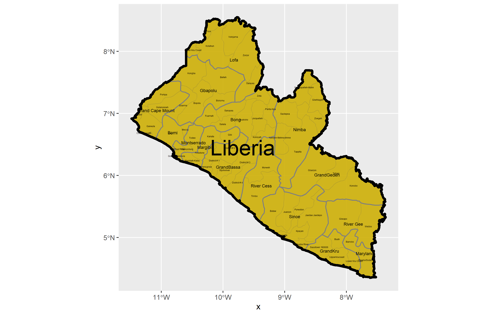
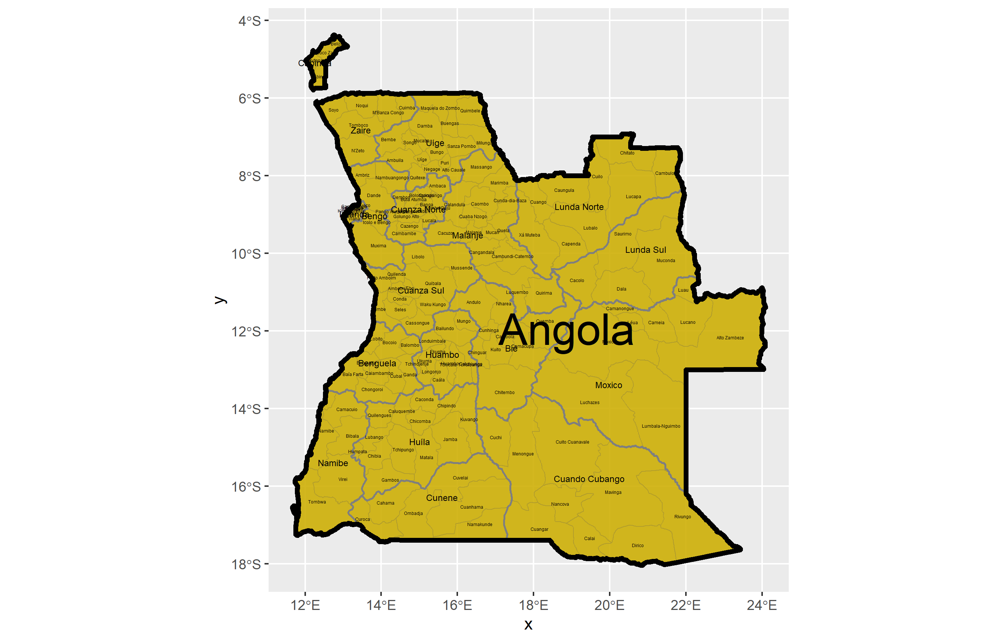
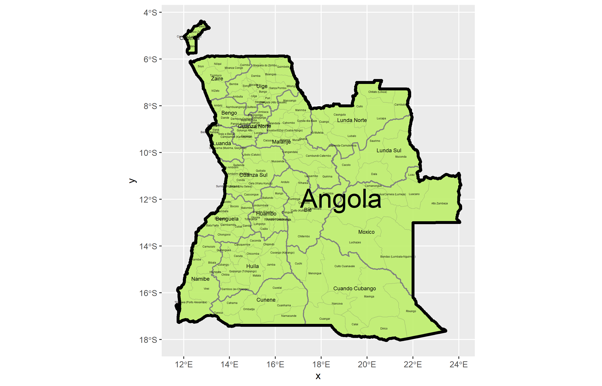

## Projecting, Plotting, and Labelling Administrative Subdivisions of Liberia

Produced a plot of Liberia with it's first and second level of administrative subdivisions. I also produced the same plot, but of Angola. 

### Individual Stretch Goal 1: 

For this part, I followed the same steps as above but took shp files from HDX. It seems that for the most part, GADM and HDX have similar data.

