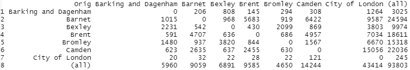

## Final Project

### Gravity Model of London

In the first part of this project, we followed a [guide by Adam Dennett](https://rpubs.com/adam_dennett/257231) to practice creating a gravity model. Gravity models as applied to migration use population sizes and distances between each location as push and pull factors, and can be expanded upon by adding in additional characteristics of the locations. The end result is a model of migration that can predict human behavior and help to provide a better understanding of situations. From Garcia et al (2015), they found that gravity models could explain up to 87% of internal migration, and demonstrated that models could predict flow even in regions where data is sparse. 

