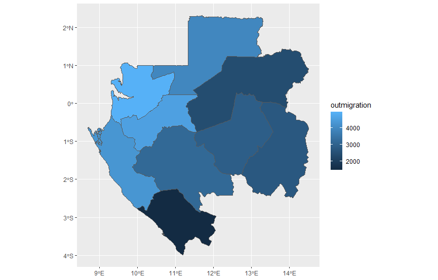

## Final Project

### Gravity Model of London

In the first part of this project, we followed a [guide by Adam Dennett](https://rpubs.com/adam_dennett/257231) to practice creating a gravity model. Gravity models as applied to migration use population sizes and distances between each location as push and pull factors, and can be expanded upon by adding in additional characteristics of the locations. The end result is a model of migration that can predict human behavior and help to provide a better understanding of situations. From Garcia et al (2015), they found that gravity models could explain up to 87% of internal migration, and demonstrated that models could predict flow even in regions where data is sparse. 

As we can see, gravity models are powerful tools. Continuing to learn them via the Dennett London example, we first pull in spatial data about London. Using the spatial data, we can calculate a distance matrix and also pull in some data about the flow of the population. Now that we have the data that we need, how do we implement a gravity model? 

According to Garcia et al, this is the modern from of the gravity model. The flux of migration between two places, *i* and *j*, is proportional to their masses (populations) and inversely proportial to the distance between them, and each of the components has an exponent that controls how strong that interaction is. 

With our London model, we follow an approach that first estimates some values for the gracity model to use when predicting flow, and then look at error values to assess how well we're estimating our parameters. However, in order to find the best parameters for us to use, we can take the logarithms of our gravity model in order to create a regression model. However, rather than using a log-normal regression model, in this case we use a Poisson regression model. This is because with migration, we need to deal with non-negative integer counts. After we have our Poisson regression model, we can use it to estimate our parameters. Once we have the new parameters, we can once again estimate our flow estimates, and it looks like this. 

### Gabon

Now that we know a little about how to make a gravity model, we can start to take a look at using these methods on our data for Gabon. We can get some data about Gabon's migration flow from [WorldPop Migration Flow](https://www.worldpop.org/geodata/summary?id=1281). Additionally, we take in [data from WorldPop about night-time lights](https://www.worldpop.org/geodata/summary?id=18614) as another characteristic of the location that we can use. 

Once we have the data loaded into RStudio, we can begin to manipulate it. The first step is to find the names of the origin and destination counties and also find the distances between them so that we can use it in our gravity model. After that, we can add in our night-time light data as another characteristic. The result is our origin destination matrix, which looks like this.

The values describe the number of people migrating from one county to another, and the diagonals are blank because there's no migration in or out of the same county an individual is in. 

For our next step, we can plot the total outmigration of each county. As we can see, it seems that the southeast area of the country generally has more outmigration compared to the eastern half. 

Looking at the inmigration next, our graph shows us that it is mainly the county with the capital that has by far the most inmigration. Whereas for the outmigration there were differences in the rates for each county, all of the counties in this case all have similarly low numbers for inmigration except for the capital. 

In order to get a better understanding of migration patterns, we can try to create an animation to get a visual representation of migration flows from county to county. For Gabon, this is the animation I produced. 

There were several steps needed in order to produce this GIF. First, we needed the center points of each county, and then also to draw a vector path between the center points for our model to move points from each origin to destination. The animation was created using gganimate, and the for this animation the data set was taken from a timespan of one year, and this could be increased with additional datasets. The gravity model could be used to create a model that better reflects reality by creating a model for which individual points have characteristics that influence their migration decisions. 

### Bendjé 

