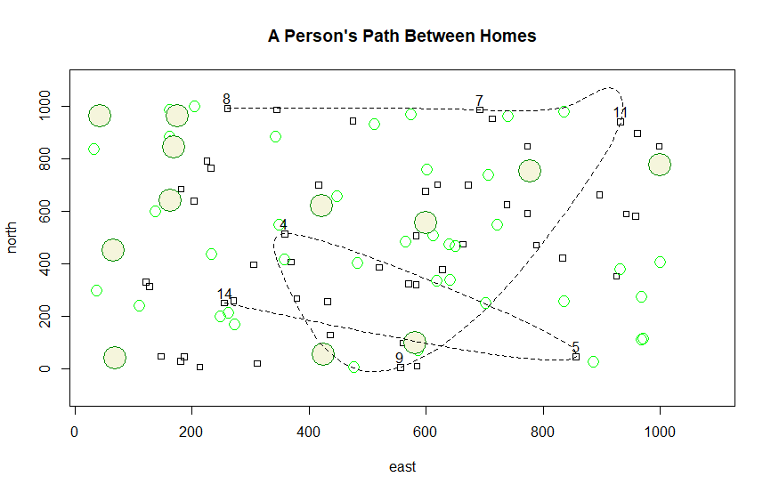

## A Person's Path Between Homes

For this Challenge Question, I created a chart with an area of 1000x1000. There are 50 homes placed randomly, and they are represented by a square symbol. There are also 40 randomly placed trees, and those are represented by small green circles with radius roughly equal to the width of each home. On the map, there are also 12 large trees which are represented by green circles with a radius roughly equal to double a home's width. Finally, there are 7 homes randomly chosen with a dashed spline describing the path between each labeled dwelling.  

