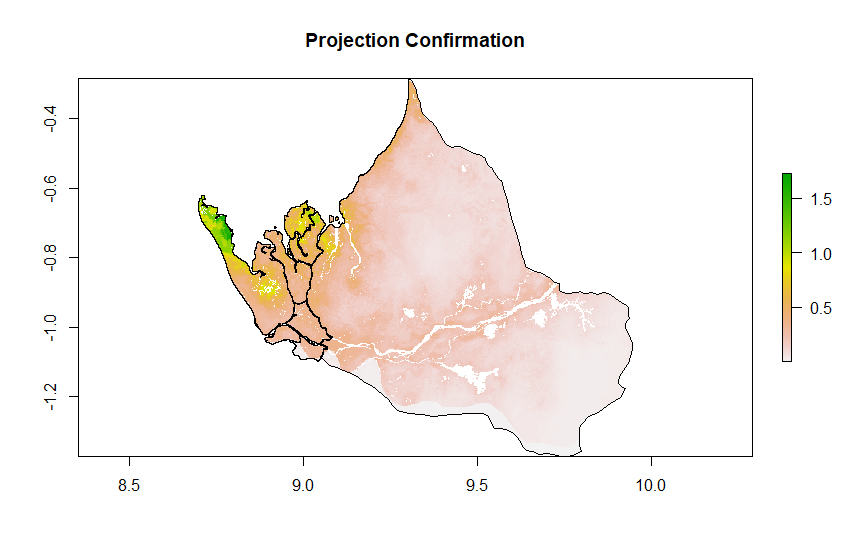

## Project 2

#### 1. Provide a written description of your selected household survey including the number of household and person observations as well as the variables in your source data.

The data for Gabon came from the 2000 DHS survey, completed by Direction Générale de la Stat. des Etudes Economiques. The data for the households has 6203 observations, with 1172 columns of data. Some of the data I used were: 

* weights
* size
* gender (hv104)
* age (hv105)
* education (hv106)

Each row of data represents one household, and each row also contained the data about gender, age, and education for each member of the household. The individual data was denoted after the column name for the data category. For example, the age of the first member of a household would be in a column named "hv105_01", and the second member in a column named "hv105_02". Each row holds up to 48 members of the same household. 

#### Provide a written description of your spatially located households at the adm0 level of your selected location, including how you located each household, generated the household structure including demographic attributes of persons, and the percent error calculated. If you faced computational issues at the adm0 level when attempting to pivot from households to persons, describe those limitations. 

In order to locate each household, the raw household data from DHS was given locations using the **rpoint** function with the real adm0 population as a way to distribute the households according to the real population density. Then, the survey data was randomly sampled so that it would reflect the population of Gabon. The error of this method was calculated by comparing the number of observations in our sample to the sum of the weights, and this error was calculated to be 0.1857%. 

I faced serious computational issues at the adm0 level when attempting to pivot from households to individual persons. The general approach was to pivot gender, age, and education individually first, and then merge them together into one dataframe. The individual pivots were not computationally expensive with about 30,000 observations each. However, merging the dataframes together ultimately took too much memory for my personal computer. I initially tried to circumvent this by using **data.tables** instead, but again the end result was that the data was too large to work with. I changed my approach by cutting as much redundant data as I could from my dataframes, and was able to pivot to 33,266 individuals. 

#### Provide a written description of your spatially located households at the adm1 or adm2 level of your selected location, again including how you located each household, generated the household structure including demographic attributes of persons, and the percent error calculated. Further analyze your synthetically generated households and persons with regard to percent error. Do you think this population is more or less accurate than the one generated at the adm0 level? What could you have done to improve your measures of accuracy?

Locating the households at the adm2 level for Bendjé mostly followed the same process as for Gabon as a whole. This time, the error was calculated to be 0.2019%. The following is a planar point pattern (PPP) generated for Bendjé. 

And also a confirmation of the projection below. 

