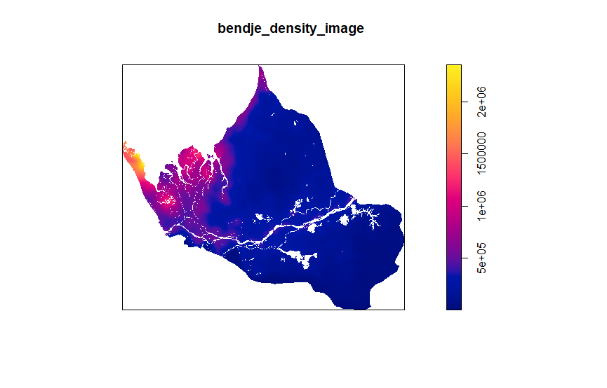

## Project 1

### Part 1: Geometric Bar Plot of Gabon

Produced a combined spatial description and geometric bar plot of Gabon's population. One modification I needed to make was importing the `scales` library instead of `units` for the percent() command. From the population and density map, we can see that the province of Estuaire is by far the most populous, and part of this could be due to the geography. Gabon's western border is the Atlantic Ocean, which probably means there are trading ports that bring rises in population with them. 

For selecting an administrative subdivision, I chose the province of Ogooué-Maritime. I chose it because it also borders the Atlantic Ocean, and I wanted to see if that had any effect on the population. I plotted the population and density using the same method as above for Gabon, and used the smaller administrative subdivisions, or departments. I thought it was really interesting how the northern department of Bendjé had by far the largest population, as it borders the most populous province, Estuaire. We can also see the same conclusion about the population distribution between the departments in Ogooué-Maritime in the following geometric bar plot. 

### De Facto Description of Human Settlements and Urban Areas

First, we start by cropping and masking our raster layer to focus on Bendjé, and this is the result. 

Next, we use the `spatstat` package in order to create a point pattern based on our geospatial distribution of all persons in Bendjé. 

Based off of the ppp, we can now create a density plot. 

We then begin to create our polygons, with a density estimate contour of 300,000. 

Finally, we can make our map of Urbanized Areas throughout Bendjé, Gabon. I was pretty surprised to see that with the exception of one tiny settlement near the middle-eastern region, all of the populated areas were on the western side. I believe that this is due to the proximity to the Atlantic Ocean. 

