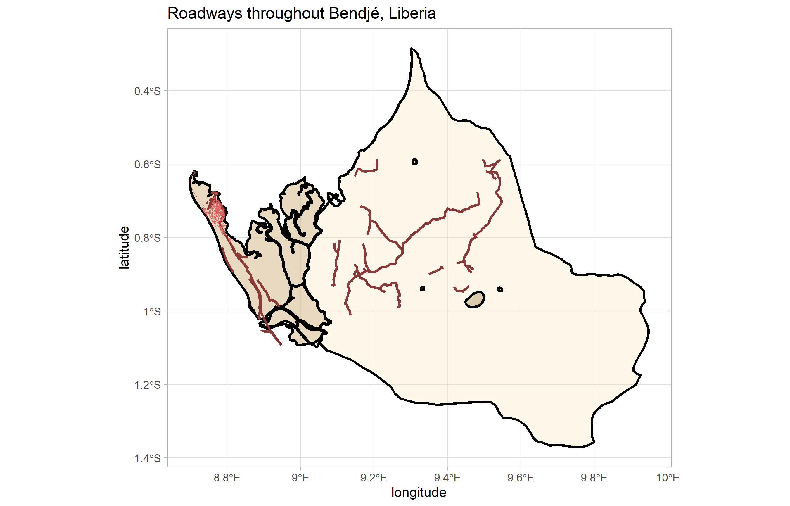
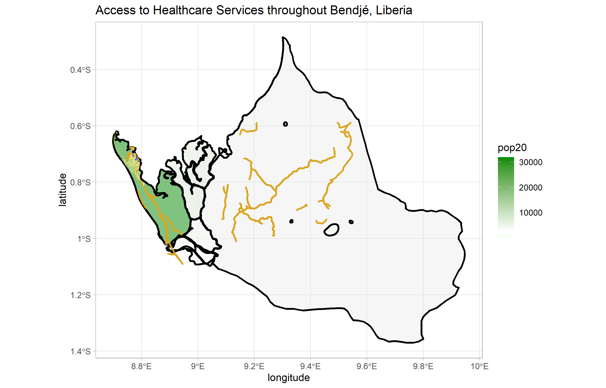

## Project 1: Part 2

### Adding Transportation Facilities and Health Care Services 

First, we start by adding roads in Bendjé. As we can see, there is not much developed road in the majority of the Bendjé department. The vast majority of the developed roads are in the populated area near the western tip, and for this map I made three different classifications of roads: the largest primary roads, then tertiary, and finally residential streets. The thickness of each road on the map correlates with which category of road it belongs to. I was orginally expecting a more comprehensive road network throughout Bendjé, and it's possible that there are additional paths throughout Bendjé that are missing in the data. 

Next, we take data for healthcare facilities from HDX. After cropping the data to Bendjé, we find that there is 1 doctor, 5 clinics, and 7 pharmacies in Bendjé. They are represented by blue dots, and we overlay this information on the roads and population data from before to get the following result. It makes sense that the healthcare in Bendjé is limited to the same northwest region that both most of the population is, and also the majority of the roadwork. 

